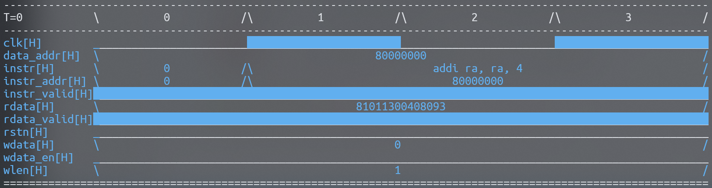
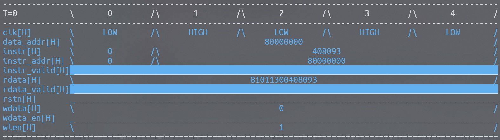
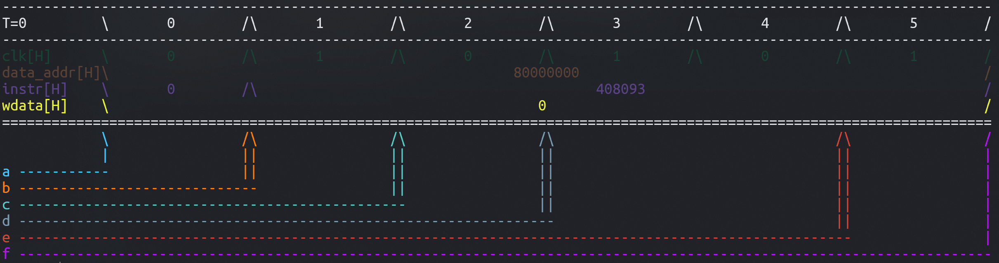

# VSH
## 项目概述
1. VSH（SHell for Visualizing vcd file）项目为数字波形文件（目前仅支持 VCD，Value Change Dump）命令行查看器。
2. 本项目采用的开源协议为：GPL v3。

## 安装
1. 部署 VSH 的环境需求（Makefile 可一键完成）：
```
python3
pip
# 国内用户建议配置清华源
pip config set global.index-url https://pypi.tuna.tsinghua.edu.cn/simple
pip install pyDigitalWaveTools
pip install cmd2
pip install capstone
```
2. 安装方法（项目默认放置到 ~/eda/vsh）：
```shell
make install # 注意：如果您的默认 shell 是 zsh，请使用 make install-zsh
cd ~/eda/vsh/ # 默认安装路径
# 若想要实现命令行直接启动 vsh，请将 ~/eda/vsh/ 加入到环境变量 PATH 当中（默认）；
```

## 命令与操作
1. load：加载 VCD 文件。
2. pwm：显示当前工作模块所在的层次，显示方式与 Linux 文件系统路径名一致。
3. cm：改变当前工作模块。
4. add：添加信号到观察列表，-f 参数可指定信号显示时的数据显示方式（b/o/d/h，即 bin/oct/dec/hex），若不指定，默认的数据显示方式为十六进制；-bg 参数指定背景色；-fg 参数指定前景色；-m 指定显示样式（0：常规；1: 加粗；2：淡色；3：斜体；4：下划线；5：闪烁等，注：与终端文本样式设置一致）。
5. del：删除观察列表中对应信号名的信号。
6. show：显示观察列表中的信号波形，其中第一列为波形的时间参数。
7. list: 显示当前模块下的信号和子模块，-s 参数用于显示加入到观察列表的信号信息（信号名 位宽 信号所属的层次）。
8. t：无参数时显示当前显示波形的时间起点与最大时间点，有整数参数 n 输入时，将 t 修改为 t + n；通过指定 -a 参数，将时间起点设置为设置值。
9. search：对指定的表达式进行分析，打印出该表达式成立的时间区间。
10. conv：对参数（二进制/八进制/十进制/十六进制的自然数）进行进制转换。
11. sfl: 当参数为 0 / 其他 时，关闭 / 启用 显示单比特信号电平状态功能。
```shell
python vsh.py "sfl" "load vcd_example/gate.vcd" "cm TOP" "add *" "show" quit
```
12. reorder：对观察列表中的信号进行重排序，将参数（index）指定的信号放在前面，其他未指明的信号不变更次序。
```shell
/TOP > list -s
0    a 1 /TOP
1    b 1 /TOP
2    y 1 /TOP
/TOP > reorder 1 1 0 0 2
/TOP > list -s
0    b 1 /TOP
1    b 1 /TOP
2    a 1 /TOP
3    a 1 /TOP
4    y 1 /TOP
```
13. disasm：反汇编功能（默认为 RV64G 汇编，目前仅支持 RV32 / RV64）：
```shell
/TOP > disasm 0x17010001
auipc sp, 0x1000
/TOP > disasm -arv32 0x17010032
auipc sp, 0x32000
```
14. mg：设置一组宏定义：
```shell
# 设置一组名称为 bus_state 的宏定义：STATE_IDLE == 0、STATE_START == 1、STATE_FINISH == 2、STATE_BUSY == 3
mg -mSTATE_IDLE&STATE_START&STATE_FINISH&STATE_BUSY -v0&1&2&3 -n bus_state
```
15. bm：将一个观察列表中的信号绑定到一组宏定义（从而可以在显示时采用宏定义进行显示）：
```shell
# 将名称为 state 的信号绑定到名称为 bus_state 的宏定义组
bm -nbus_state -sstate
```
16. bd：将信号绑定到指定架构的反汇编器（若不指定则绑定到 RV64 反汇编器）：
```shell
将名称为 instr 的信号绑定到 rv32 反汇编器
bd -arv32 -sinstr
```
17. color： 设置信号显示时的前景色（-fg）、背景色（-bg）、显示样式（-m），其中前景色 / 背景色，均使用六位的八进制数指定，如 0xff0000 为红色；如果想要设置一种随机的前景色 / 背景色，可通过 -fgr / -bgr 指定。
18. marker：设置标号，-l 参数显示所有标号；-t 参数指定标号对应的时间点；-d 参数删除指定标号；-i 参数用于根据下标指定标号；-fg / -bg / -m 用于指定标号的颜色与样式；-fgr / -bgr 用于为标号设置随机的前景色 / 背景色。
19. 目前支持的所有命令（包括 cmd 内置命令）：
```shell
Custom Commands
===============
add  cm     del     exit   list    mg   quit     search  t
bd   color  disasm  intro  load    pwm  reorder  sfl
bm   conv   e       l      marker  q    s        show

cmd2 Built-in Commands
======================
alias  help     ipy    run_pyscript  set    shortcuts
edit   history  macro  run_script    shell
```

## 使用示例
1. 打开 vcd_example 目录下的 gate.vcd 文件并显示波形（在 vsh 项目目录下运行 vsh）：
``` shell
vsh> load vcd_example/gate.vcd
/ > cm TOP
/TOP > list
a 1
b 1
y 1
gate
/TOP > add *
/TOP > show
----------------------------------------------------------------------------------
T=0   \0 /\1 /\2 /\3 /\4 /\5 /\6 /\7 /\8 /\9 /\10/\11/\12/\13/\14/\15/\16/\17/\18/
----------------------------------------------------------------------------------
a[H]  \0 /\1 /\0 /\1 /\0 /\1 /\0 /\                      1                       /
b[H]  \  0   /\  1   /\  0   /\                        1                         /
y[H]  \1 /\    0     /\1 /\                          0                           /
==================================================================================
/TOP > e
```
2. 使用 search 功能：
```shell
vsh> load vcd_example/gate.vcd
/ > cm TOP
/TOP > add *
/TOP > search "y==1"
[0, 1) [4, 5)
# 该结果说明，在 t = 0 和 t = 4 两个时间点上，y == 1 的条件成立；
```
3. 通过反汇编器显示指令的具体内容：
```shell
python vsh.py "sfl" "load vcd_example/curva_wave.vcd" "cm TOP" "t" "add *" "bd -arv64 -sinstr" "show" "exit"
```


4. 通过绑定宏定义组，显示信号的宏而非值（clk 信号显示为 HIGH / LOW 以表示 1 / 0）：
```shell
python vsh.py "sfl" "load vcd_example/curva_wave.vcd" "cm TOP" "add *" "mg -mHIGH&LOW -v1&0 -nCLK" "bm -nCLK -sclk" "show" "exit"
```


5. **通常定位 RTL 中的 BUG 需要在 vsh 中执行一系列的操作；而在下一次打开 vsh 时，我们希望能够重新定位该处 BUG，这时对命令历史进行导出以形成启动文件将有助于提高调试效率：**
```shell
# 定义 save 命令，该命令可以将本次调试操作的所有命令保存到一个以时间戳命名的启动文件
vsh> alias create save history "|" sed 's/^ *[0-9]*[ ]*//' ">" .vsh_start_$(date +"%Y_%m_%d_%H_%M_%S")
# 此后执行若干调试操作
vsh> ...
# 保存操作为启动文件
vsh> save
```
**启动文件被保存后，可以通过命令行方式执行：**
```shell
vsh "run_script .vsh_start_up_2025_01_01_19_00_00" "exit"
```
6. 设置显示时的信号颜色：
```python
python vsh.py "load vcd_example/curva_wave.vcd" "cm TOP" "add clk -fg 0x194235" "add data_addr -fg 0x594235" "add instr -fg 0x594285" "add wdata -fg 0xe9f235" "show" "list -s"
```
7. 修改显示时的信号颜色：
```shell
# python vsh.py "load vcd_example/curva_wave.vcd" "cm TOP" "add clk -fg 0x194235" "add data_addr -fg 0x594235" "add instr -fg 0x594285" "add wdata -fg 0xe9f235" "show"
vsh> color -fg 0x323672 -i 3
vsh> show
vsh> list -s
```
8. 设置随机的背景 / 前景颜色：
```shell
vsh> color -fgr -i 3
vsh> color -bgr -i 0
vsh> show
```
9. 添加标号并显示（通过 -i 参数指定要删除、修改的某个 marker 的下标）：
```shell
# 在时间点 3 添加一个名称为 m0 的标号，设置随机的前景色
vsh> marker -t 3 m0 -fgr

# 修改标号 m0，使得其时间点变更为 4，并设置随机的前景色（注意：相同时间点设置不同名称 / 相同名称设置不同时间的标号后者会覆盖前者）
vsh> marker -t 4 m0 -fgr

# 显示所有标号
vsh> marker -l

# 删除标号 m0
vsh> marker -d m0
vsh> marker -d -i 0

# 演示
python vsh.py "load vcd_example/curva_wave.vcd" "cm TOP" "add clk -fg 0x194235" "add data_addr -fg 0x594235" "add instr -fg 0x594285" "add wdata -fg 0xe9f235" "show" "list -s" "marker -t 0 a -fgr" "marker -t 1 b -fgr" "marker -t 2 c -fgr" "marker -t 3 d -fgr" "marker -t 5 e -fgr" "marker -t 6 f -fgr" "show"
```


## 注意事项
1. 在加载 vcd 文件成功以后，prompt 会变为 /，此时代表目前在根模块，即 TOP 模块的父模块，通过 cm TOP 命令即可进入 TOP 模块。
2. 显示的波形文件中，\ / 为分隔符，无任何含义；信号名后的 [H] 代表数据当前的显示格式为十六进制（在添加信号进入观察列表时，可以通过 add -f b/o/d/h signal_name 设置）。

## 其他说明
1. 在命令行启动 vsh 时通过指定字符串参数，可以使得该应用在启动以后自动执行参数指定的命令：
```shell
./vsh.py "t" "intro" "t 1" "intro" quit

# 在该项目的 vsh 目录下执行：
python vsh.py "load vcd_example/gate.vcd" "cm TOP" "add *" "show" quit
python vsh.py "sfl" "load vcd_example/gate.vcd" "cm TOP" "add *" "show" quit
``` 
2. 默认情况下，VSH 支持命令历史，其历史将保存在同一目录下的 .vsh_history 文件中。
3. 通过 verilator 导出的 vcd 文件，TOP 模块对仿真的顶层模块进行了封装，相当于 TOP 模块当中包含了整个顶层模块，因此顶层模块的接口和模块本身都可以通过在 TOP 模块调用 list 命令查看。

## 贡献列表
1. 参与本项目的成员如下：
```
扶摇 fuyao-cu@outlook.com
```

## TODO：
1. show 命令下，部分信号的名称可能太长，支持观察列表中信号的 alias 会更好。
2. load 命令尚不支持相对路径（比如家目录：~），而只能使用绝对路径。
3. 目前尚未约束 vcd 文件中定义的最大时间，导致信号显示的范围有可能比 vcd 文件本身所定义的时间范围更大（使用了最后一个时刻的信号值填充）。
4. 考虑让 cm 命令支持类似于 linux 的相对路径：../a/b/./../c/d。
5. 考虑改进 list 命令显示的格式：模块下不同类型的子节点（信号/子模块）显示不同的颜色；命令输出的内容一项占据了一行，可考虑将其改进为类似于 linux 的 ls 命令的显示格式。
6. 命令的 help 信息有待完善。
7. 添加英文版 readme.md。
8. 显示信号支持 x / z 态，而搜索功能暂不支持 x / z 态。

## 开发者说明
1. search 方法的实现机制：（注意，超过 vcd 文件最大时间的信号值，vsh 认为它保持了原值并一直持续到 +inf）
- 它首先分解表达式形式语法树，对于表达式中的常量部分直接解析为常量节点，而非常量（信号值）则转换为右值并附加一个 ? 运算符以表明其为非常量（注意：内置的一个非常量为时间 t 值，它的名称为 @t 或 @T）；
- 在解析表达式的过程中每个非常量（即信号名）会被放入到全局变量 search_var_list 当中，此后检查这些非常量是否已经被添加到 spy list 中，若发现未添加则报错并退出；
- 此后再对所有加入 search_var_list 的信号值发生变化的时间点进行收集构成 time_point_for_search，在这些时间点上对该表达式进行 eval，从而判断表达式是否成立；
- 对所有表达式成立的时间点进行组合，并打印出表达式成立的区间（T 的一系列左闭右开的区间），如：[1, 7) [11, 9) [100, +inf)。
2. search 方法目前存在的问题：关于 @T 的表达式所形成的区间节点无法被纳入到 time_point_for_search 当中，从而出现问题，如 search "@T>3"，无法正确地分析出结果（结果应该为[3, +inf)），或许放弃在表达式中支持 @T，转而通过增加一个 -t 参数项以支持时间值的筛选更合适。

## BUG
1. 待测试 ... 

## 更新说明
1. 支持无参数时，marker 显示标号列表；

